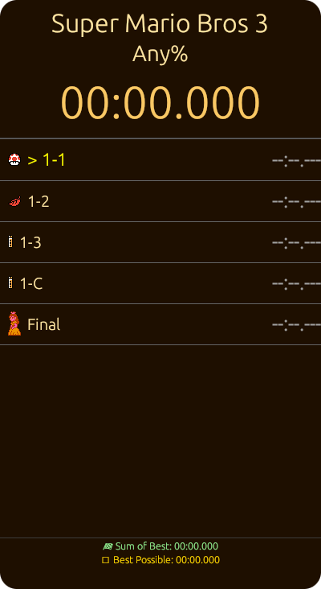
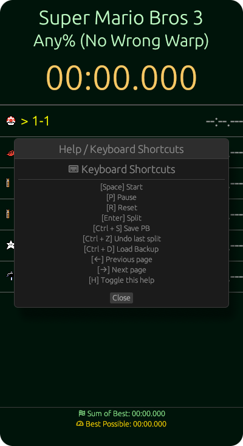
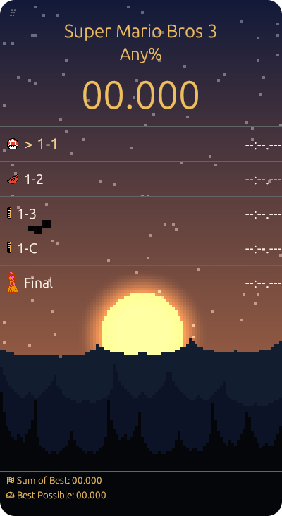
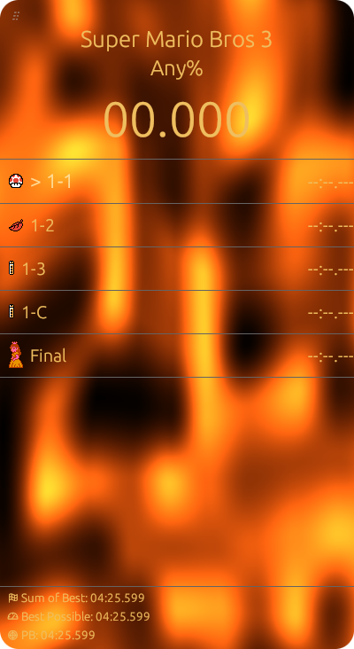
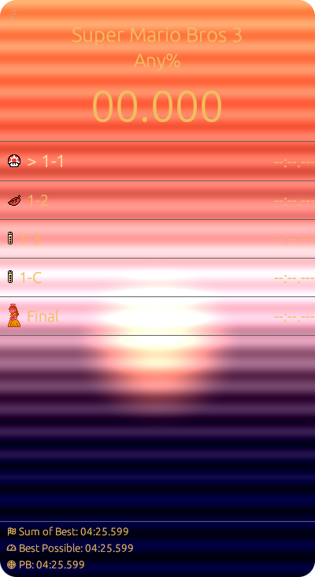

# OpenSpeedRun

**OpenSpeedRun** is a modern and minimalistic open-source speedrun timer designed for Unix systems. It features a clean GUI, external CLI control, and customizable themes.


|  |  |
|----------------------------------------|-----------------------------------------|

## Features

- ✨ Lightweight and responsive GUI
- 🖼️ Theme customization (colors, font sizes, and visibility toggles)
- 🧩 Split editor with support for icons and pagination
- 🔧 Config editor for managing themes and splits
- 🖥️ CLI interface for external control
- 📦 No dependencies on non-Unix libraries

## Binaries

OpenSpeedRun provides 3 executables:

- `openspeedrun`: the main GUI speedrun timer
- `openspeedrun-cli`: a command-line tool to control the timer externally (e.g., split, reset, pause), available only for Unix.
- `openspeedrun-cfg`: configuration GUI to manage themes and splits

## 📦 Install from Releases

Precompiled binaries are available for **Windows**, **Linux**, and **macOS** in the [Releases](https://github.com/tu_usuario/OpenSpeedRun/releases) section.

### 🪟 Windows

1. Go to the [Releases](https://github.com/tu_usuario/OpenSpeedRun/releases) page.
2. Download the `.zip` for Windows (e.g. `openspeedrun-windows-x86_64.zip`).
3. Extract it anywhere (e.g. `C:\Games\OpenSpeedRun\`).
4. Run `openspeedrun.exe`.

> ✅ You can also run `openspeedrun-cfg.exe` for configuration.

---

### 🐧 Linux

1. Download the `.zip` for Linux (e.g. `openspeedrun-linux-gnu-x86_64.zip`).
2. Extract it:
   ```bash
   unzip openspeedrun-linux-gnu-x86_64.zip
   ```
3. Move the binaries to somewhere in your PATH, or run from current directory:
   ```bash
   ./openspeedrun
   ```

> 💡 You may need to make the binaries executable:
> ```bash
> chmod +x openspeedrun openspeedrun-cfg openspeedrun-cli
> ```

---

### 🍎 macOS

> ⚠️ Currently untested on macOS. You can try the following steps:

1. Download the macOS zip file (e.g. `openspeedrun-macos-x86_64.zip`).
2. Extract it:
   ```bash
   unzip openspeedrun-darwin-x86_64.zip
   ```
3. Run from terminal:
   ```bash
   ./openspeedrun
   ```

> 🛡️ If you get a “cannot be opened because it is from an unidentified developer” error, try:
> ```bash
> chmod +x openspeedrun
> xattr -d com.apple.quarantine openspeedrun
> ```

## Build From Source

Build with Cargo:

```bash
cargo build --release
```

Or install directly:

```bash
cargo install --path .
```

## Usage

To start the timer:

```bash
openspeedrun
```

To configure splits and themes:

```bash
openspeedrun-cfg
```

## External Control via CLI

`openspeedrun` includes a companion binary: `openspeedrun-cli`, designed for both **Wayland** and **X11** environments.

Since many Wayland compositors do not support global hotkeys, and even on X11 you may prefer custom shortcuts, `openspeedrun-cli` allows you to control the timer externally.

You can bind system-wide keyboard shortcuts in your window manager or compositor to commands like:

```bash
openspeedrun-cli split
```
This enables full control (start, pause, reset, split) without relying on the GUI, ensuring compatibility and flexibility in any environment.

## Hotkeys

On Windows, OpenSpeedRun supports customizable hotkeys.  
You can assign your own keys for actions like start, split, and reset using the `openspeedrun-cfg` configuration tool.

### Example hotkeys:
- Start/Stop: `F1`
- Split: `F2`
- Reset: `F3`

# Shaders

For shaders used as backgrounds in this app, follow these conventions to ensure compatibility and expected behavior.

Supported versions are: `1.10, 1.20, 1.30, 1.40, 1.50, 3.30, 4.00, 4.10, 4.20, 4.30, 4.40, 4.50, 4.60, 1.00 ES, 3.00 ES, 3.10 ES, and 3.20 ES`

## ✅ Vertex Shader Requirements

* You must explicitly declare a #version directive — e.g., #version 100 (minimum supported version).
* Use **GLSL ES 1.00** or higher.
* Define an attribute named `a_pos` of type `vec2`.
* Compute `gl_Position` from `a_pos`.
* No additional outputs are required unless your fragment shader needs them.

> 💡 You may use higher versions like `#version 330 core` when running in desktop OpenGL contexts. This allows for more modern syntax (`in`, `out`, `layout`, etc.) and features.

### Example — Vertex Shader (`#version 100`)
```glsl
#version 100
attribute vec2 a_pos;

void main() {
    gl_Position = vec4(a_pos, 0.0, 1.0);
}
```

### Example — Vertex Shader (`#version 330 core`)
```glsl
#version 330 core

in vec2 a_pos;
out vec2 v_uv;

void main() {
    v_uv = (a_pos + 1.0) * 0.5;
    gl_Position = vec4(a_pos, 0.0, 1.0);
}
```

## ✅ Fragment Shader Requirements

* You must explicitly declare a #version directive — e.g., #version 100 (minimum supported version).
* Use **GLSL ES 1.00** or higher.
* Use `gl_FragCoord` or interpolated UVs to compute per-pixel output.

> 🖍️ In GLSL 1.00, write to `gl_FragColor`.  
> 🎨 In modern GLSL (`#version 330 core`), define an `out vec4` like `FragColor`.

Uniforms:
| Alias(es)                            | Description                                    |
|--------------------------------------|------------------------------------------------|
| `u_time`, `time`, `iTime`                           | Elapsed time in seconds                          |
| `u_resolution`, `resolution`, `iResolution`         | Viewport size in pixels                          |
| `u_mouse`, `mouse`, `iMouse`                        | Is always `(0, 0)`                               |
| `deltaTime`, `u_deltaTime`, `iTimeDelta`            | Time elapsed between frames in seconds           |
| `u_date`, `date`, `iDate`                           | Current date: (year, month, day, seconds)        |


### Example — Fragment Shader (`#version 100`)
```glsl
#version 100
precision mediump float;

uniform float u_time;
uniform vec2 u_resolution;

void main() {
    vec2 uv = gl_FragCoord.xy / u_resolution;
    gl_FragColor = vec4(uv, abs(sin(u_time)), 1.0);
}
```

### Example — Fragment Shader (`#version 330 core`)
```glsl
#version 330 core

in vec2 v_uv;
out vec4 FragColor;

uniform float u_time;
uniform vec2 u_resolution;

float wave(vec2 uv, float speed, float freq, float amp) {
    return sin((uv.x + u_time * speed) * freq) * amp +
           cos((uv.y + u_time * speed * 0.8) * freq * 0.7) * amp * 0.5;
}

void main() {
    vec2 uv = v_uv;

    float distortion = wave(uv, 0.4, 8.0, 0.02);
    vec2 distorted_uv = uv + vec2(distortion);

    float depth = 0.5 + 0.5 * sin(10.0 * distorted_uv.x + u_time)
                        * cos(10.0 * distorted_uv.y + u_time);

    vec3 water_color = mix(vec3(0.0, 0.2, 0.4), vec3(0.0, 0.6, 1.0), depth);

    float specular = pow(max(0.0, depth), 3.0);
    water_color += specular;

    FragColor = vec4(water_color, 1.0);
}
```

for examples of shaders, see the [shaders](docs/SHADERS.md) directory.

### Showcase

|  |  |  | 
|----------------------------------------|-----------------------------------------|-----------------------------------------|

## Status and Licensing

OpenSpeedrun is currently under active development and fully usable.

Released under the [BSD 3-Clause License](LICENSE), the software is free to use, modify, and redistribute, with or without contributions back to the original project.

---

Made with ❤️ for the speedrunning community.
