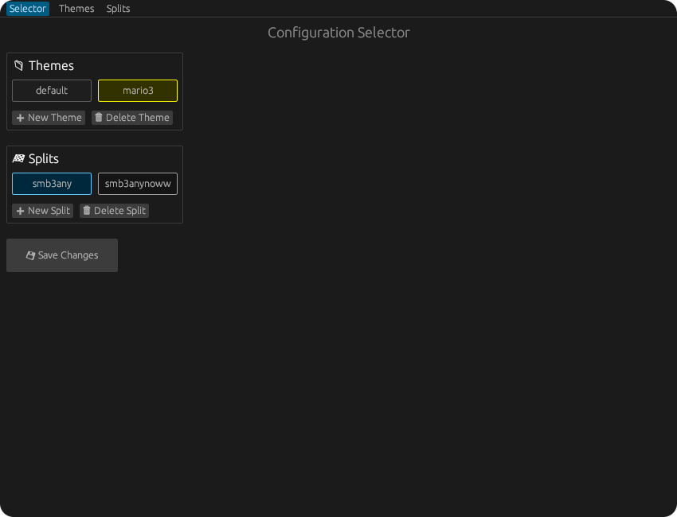
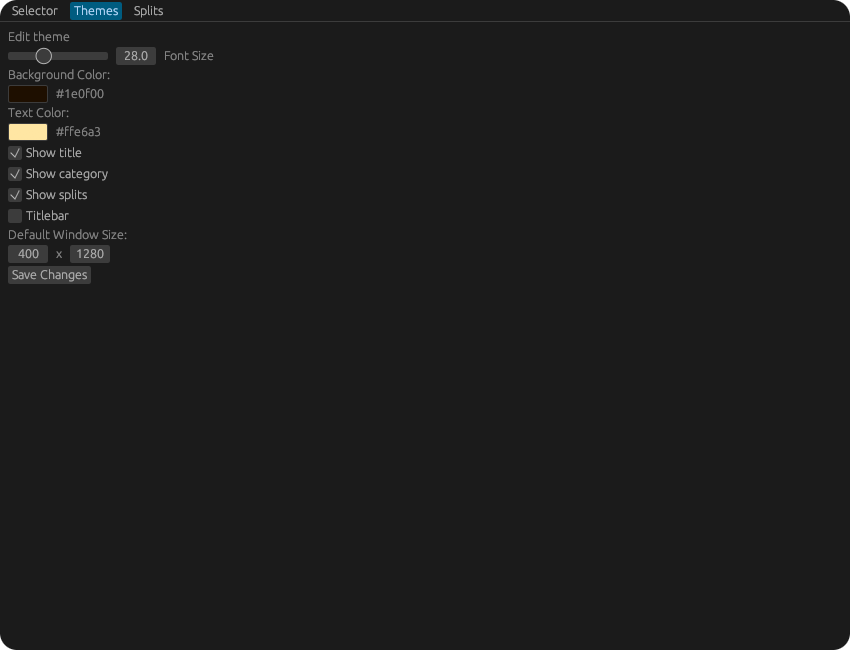
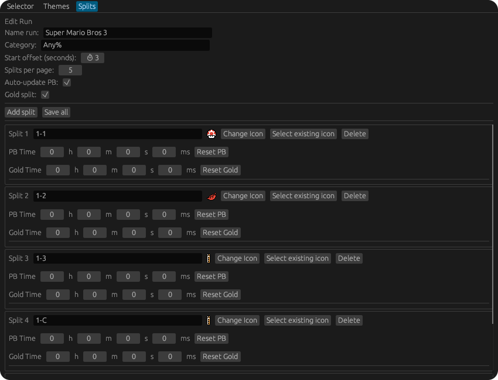

# OpenSpeedRun

**OpenSpeedRun** is a modern and minimalistic open-source speedrun timer designed for Unix systems. It features a clean GUI, external CLI control, and customizable themes.


|  |  |
|----------------------------------------|-----------------------------------------|

## Features

- ✨ Lightweight and responsive GUI
- 🖼️ Theme customization (colors, font sizes, and visibility toggles)
- 🧩 Split editor with support for icons and pagination
- 🔧 Config editor for managing themes and splits
- 🖥️ CLI interface for external control
- 📦 No dependencies on non-Unix libraries

## Binaries

OpenSpeedRun provides 3 executables:

- `openspeedrun`: the main GUI speedrun timer
- `openspeedrun-cli`: a command-line tool to control the timer externally (e.g., split, reset, pause)
- `openspeedrun-cfg`: configuration GUI to manage themes and splits

## Installation

Build with Cargo:

```bash
cargo build --release
```

Or install directly:

```bash
cargo install --path .
```

## Usage

To start the timer:

```bash
openspeedrun
```

To configure splits and themes:

```bash
openspeedrun-cfg
```

## External Control via CLI

`openspeedrun` includes a companion binary: `openspeedrun-cli`, designed for both **Wayland** and **X11** environments.

Since many Wayland compositors do not support global hotkeys, and even on X11 you may prefer custom shortcuts, `openspeedrun-cli` allows you to control the timer externally.

You can bind system-wide keyboard shortcuts in your window manager or compositor to commands like:

```bash
openspeedrun-cli split
```
This enables full control (start, pause, reset, split) without relying on the GUI, ensuring compatibility and flexibility in any environment.

## Screenshot

<p align="center">
  
  
  
</p>

## Status and Licensing

OpenSpeedrun is currently under active development and fully usable.

Released under the [BSD 3-Clause License](LICENSE), the software is free to use, modify, and redistribute, with or without contributions back to the original project.

---

Made with ❤️ for the speedrunning community.