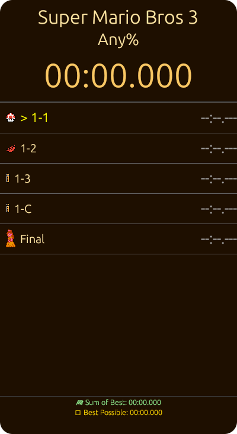
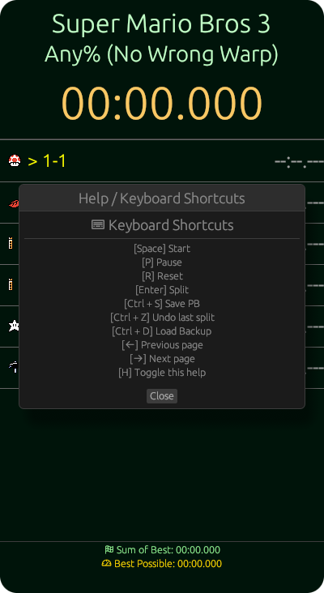
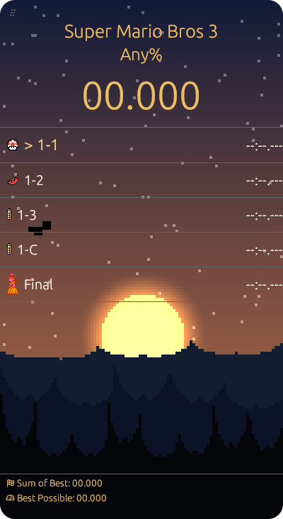
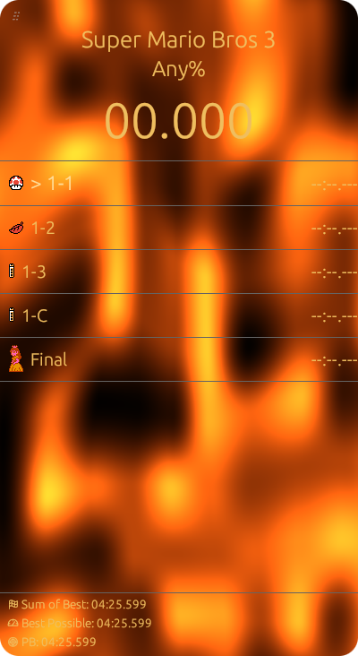
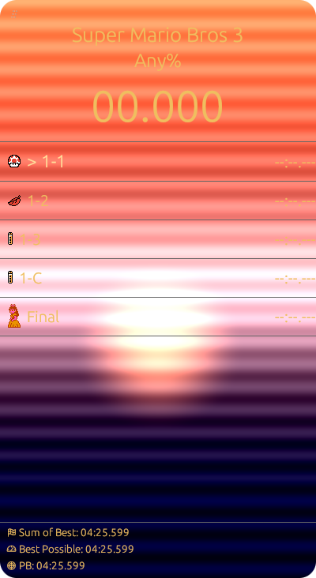

# OpenSpeedRun

**OpenSpeedRun** is a modern and minimalistic open-source speedrun timer designed for Unix systems. It features a clean GUI, external CLI control, and customizable themes.

|  |  |
| -------------------------------------- | --------------------------------------- |

## Features

- ✨ Lightweight and responsive GUI
- 🖼️ Theme customization (colors, font sizes, and visibility toggles)
- 🧩 Split editor with support for icons and pagination
- 🔧 Config editor for managing themes and splits
- 🖥️ CLI interface for external control
- 📦 No dependencies on non-Unix libraries

## Binaries

OpenSpeedRun provides 4 executables:

- `openspeedrun`: the main GUI speedrun timer
- `openspeedrun-cli`: a command-line tool to control the timer externally (e.g., split, reset, pause), available only for Unix.
- `openspeedrun-cfg`: configuration GUI to manage themes and splits
- `openspeedrun-autosplitter`: a headless autosplitter (see [Autosplitting](#autosplitting) below), available only for Unix.

## 📦 Install from Releases

Precompiled binaries are available for **Windows**, **Linux**, and **macOS** in the [Releases](https://github.com/SrWither/OpenSpeedRun/releases) section.

### 🪟 Windows

1. Go to the [Releases](https://github.com/SrWither/OpenSpeedRun/releases) page.
2. Download the `.zip` for Windows (e.g. `openspeedrun-windows-x86_64.zip`).
3. Extract it anywhere (e.g. `C:\Games\OpenSpeedRun\`).
4. Run `openspeedrun.exe`.

> ✅ You can also run `openspeedrun-cfg.exe` for configuration.

---

### 🐧 Linux

1. Download the `.zip` for Linux (e.g. `openspeedrun-linux-gnu-x86_64.zip`).
2. Extract it:
   ```bash
   unzip openspeedrun-linux-gnu-x86_64.zip
   ```
3. Move the binaries to somewhere in your PATH, or run from current directory:
   ```bash
   ./openspeedrun
   ```

> 💡 You may need to make the binaries executable:
>
> ```bash
> chmod +x openspeedrun openspeedrun-cfg openspeedrun-cli openspeedrun-autosplitter
> ```

#### AUR

You can also install it on ArchLinux-based distributions from [AUR](https://aur.archlinux.org/packages/openspeedrun-bin)

---

### 🍎 macOS

> ⚠️ Currently untested on macOS. You can try the following steps:

1. Download the macOS zip file (e.g. `openspeedrun-macos-x86_64.zip`).
2. Extract it:
   ```bash
   unzip openspeedrun-darwin-x86_64.zip
   ```
3. Run from terminal:
   ```bash
   ./openspeedrun
   ```

> 🛡️ If you get a “cannot be opened because it is from an unidentified developer” error, try:
>
> ```bash
> chmod +x openspeedrun
> xattr -d com.apple.quarantine openspeedrun
> ```

## Build From Source

Build with Cargo:

```bash
cargo build --release
```

Or install directly:

```bash
cargo install --path .
```

## Usage

To start the timer:

```bash
openspeedrun
```

To configure splits and themes:

```bash
openspeedrun-cfg
```

## External Control via CLI

`openspeedrun` includes a companion binary: `openspeedrun-cli`, designed for both **Wayland** and **X11** environments.

Since many Wayland compositors do not support global hotkeys, and even on X11 you may prefer custom shortcuts, `openspeedrun-cli` allows you to control the timer externally.

You can bind system-wide keyboard shortcuts in your window manager or compositor to commands like:

```bash
openspeedrun-cli split
```

This enables full control (start, pause, reset, split) without relying on the GUI, ensuring compatibility and flexibility in any environment.

## Autosplitting

`openspeedrun-autosplitter` watches a value in memory and turns it into `start`/`split`/`reset`/`pause` commands, sent over the same control socket as `openspeedrun-cli`. It supports two targets with very different privilege requirements — pick RetroArch whenever the game is emulated.

If neither fits your case (a game with its own scripting/mod support, say), nothing stops you from writing your own watcher that shells out to `openspeedrun-cli` or connects to the same control socket directly — that's the integration point, not `openspeedrun-autosplitter` itself.

### Emulators (RetroArch) — no elevated privileges

RetroArch (and compatible libretro cores) expose a plaintext, opt-in UDP protocol built for exactly this, so reading emulated RAM needs no special permissions at all.

**Setup:**

1. In RetroArch, enable `Settings → Network → Network Commands` (this opens its UDP command port, `55355` by default).
2. Create `autosplitter.json` next to your run's `split.json`:
   ```json
   {
     "target": { "kind": "retroarch" },
     "poll_interval_ms": 50,
     "watches": [
       {
         "name": "room_id",
         "address": "0x7E0020",
         "value_type": "u8",
         "condition": { "kind": "changed" },
         "action": "split"
       }
     ]
   }
   ```
3. Run it: `openspeedrun-autosplitter path/to/autosplitter.json`

### Native games (advanced, opt-in) — reads process memory

Autosplitting a native/unmodified game requires reading its process memory directly, via `/proc/<pid>/mem`. **This is a real reduction in process isolation, not a formality**: on Linux, reading another process's memory needs ptrace access to it, which by default (Yama's `ptrace_scope`) only your process's own children get. To use this you must do one of:

- Relax it for your whole session: `echo 0 | sudo tee /proc/sys/kernel/yama/ptrace_scope` (resets on reboot; lets *any* of your processes ptrace *any other*, not just this pairing).
- Or grant just this one binary the capability instead (narrower): `sudo setcap cap_sys_ptrace=ep $(command -v openspeedrun-autosplitter)`.

Nothing in the config format defaults you into this — it only activates if you explicitly write `"kind": "process_memory"`.

```json
{
  "target": { "kind": "process_memory", "process_name": "game.bin" },
  "poll_interval_ms": 33,
  "watches": [
    {
      "name": "room_id",
      "address": "0x4A9F00",
      "module": "game.bin",
      "pointer_path": ["0x18", "0x10"],
      "value_type": "u32",
      "condition": { "kind": "changed" },
      "action": "split"
    }
  ]
}
```

- `process_name` / `module`: matched against `/proc/<pid>/comm` (truncated to 15 bytes by the kernel) and the `/proc/<pid>/exe` symlink's file name.
- `address`: an offset from `module`'s load base (ASLR-safe) if `module` is set, otherwise an absolute address.
- `pointer_path` (optional): ASL-style multi-level pointer chase — `address` is read as a pointer, each offset in turn is added and re-read as a pointer, and the last offset lands on the actual value. Omit it if `address` already points straight at the value.
- `openspeedrun-autosplitter` waits for `process_name` to appear if it isn't running yet, and goes back to waiting if the process exits mid-run (e.g. a crash) — no need to restart the watcher between attempts.

Finding the right `address`/`pointer_path` values is manual work regardless of tool (RetroArch's own cheat search, GDB, a community RAM map, etc.) — that part isn't something this project can do for you.

#### Finding `process_name`

```bash
pgrep -la .                 # list every running process with its full name
ps aux | grep -i <game>     # or filter for something you recognize
cat /proc/<pid>/comm        # confirm the exact string this project matches against
```

Match against whatever `/proc/<pid>/comm` actually shows, not the executable's full file name — the kernel truncates `comm` to 15 bytes, so `my_real_game.x86_64` shows up as `my_real_game.x8`.

Two caveats worth knowing before you build a config around this:

- **Steam games via Proton/Wine**: the process Linux sees may be `wine64`/`wineserver` rather than the original `.exe`'s name, and offsets written for a native Windows autosplitter may not line up the same way once mapped through Wine. Unverified — hasn't been tested against a real Proton game.
- **Emulators run standalone (e.g. plain FCEUX, not through RetroArch)**: `process_memory` *can* attach to the emulator's own process, but you'd be reading the emulator's internal memory layout, not the emulated console's RAM at its documented address. Community RAM maps (datacrystal, etc.) assume the console's own address space — which is exactly what RetroArch's `READ_CORE_MEMORY` gives you for free, but a raw ptrace attach to FCEUX does not. You'd have to locate the RAM buffer yourself with a memory scanner (`scanmem`/`GameConqueror`), it's likely behind a pointer (so you'd need `pointer_path` too), and the offset isn't guaranteed stable across FCEUX versions. If the emulator has a RetroArch core (FCEUmm, for NES), prefer that over attaching to the standalone emulator directly.

### Watch format (both targets)

Each `watch` reads a value as `value_type` (`u8`/`u16`/`u32`/`u64`/`i8`/`i16`/`i32`/`i64`, `endian` defaults to `little`), and fires `action` (`start`/`split`/`reset`/`pause`) the moment `condition` transitions into true — never on the first sample read (there's no way to tell a genuine transition from wherever the value happened to be when it attached), and never again on every subsequent sample while it continues to hold. Condition kinds: `equals`/`not_equals`/`greater_than`/`less_than` (each take a `value`), plus `increased`/`decreased`/`changed` (compare against the previous sample, no `value` needed).

## Overlay Server (OBS browser source)

`openspeedrun` can expose the live timer, splits, and comparisons over a local WebSocket, meant to be consumed by an OBS **browser source** (or any custom overlay/companion tool) — the same role LiveSplit's "LiveSplit Server" component plays, but JSON instead of a plaintext line protocol.

Off by default (it's a listening socket, so it shouldn't turn on just because a config file exists). Enable it in `openspeedrun-cfg` → **Options** → "Enable OBS overlay server", or by hand-editing your theme's JSON:

```json
{
  "options": {
    "enable_overlay_server": true,
    "overlay_server_port": 7331
  }
}
```

Once running, connect to `ws://127.0.0.1:7331` (bound to localhost only). Every ~33ms, each connected client gets a full JSON snapshot:

```json
{
  "title": "Super Mario Bros",
  "category": "Any%",
  "attempts": 42,
  "timing_method": "real_time",
  "selected_comparison": "Personal Best",
  "timer_state": "running",
  "current_time_ms": 84230,
  "secondary_label": null,
  "secondary_time_ms": null,
  "current_split_index": 2,
  "total_splits": 8,
  "sum_of_best_ms": 612400,
  "best_possible_time_ms": 700100,
  "pb_time_ms": 715300,
  "previous_segment_delta_ms": -230,
  "splits": [
    {
      "name": "World 1-1",
      "is_current": false,
      "cumulative_time_ms": 30120,
      "segment_time_ms": 30120,
      "segment_comparison_ms": 29800,
      "delta_ms": 320
    }
  ]
}
```

- `current_time_ms` / `secondary_time_ms`: the run's authoritative clock and (once it's actually been used this attempt) the other one — Real Time and Game Time, whichever way around `timing_method` has them.
- Every `*_time_ms`/`delta_ms` field is a plain integer (milliseconds, signed where negative means "ahead"); format it however your overlay wants — the server doesn't pre-render strings.
- `segment_time_ms`/`segment_comparison_ms` are **segment** (this split alone) times, not cumulative-from-start; `cumulative_time_ms` is the total elapsed time when that split was hit.

A ready-to-use overlay showing all of the above (title/category, timer with IGT/RTA secondary clock, attempts, Sum of Best, Best Possible, PB, and a colored splits list) lives at [`exampleconfig/overlay.html`](exampleconfig/overlay.html) — point an OBS browser source (or a regular browser tab, to check it connects first) straight at that file, no build step needed. Or for a from-scratch minimal page:
  ```html
  <div id="timer"></div>
  <script>
    const ws = new WebSocket("ws://127.0.0.1:7331");
    ws.onmessage = (event) => {
      const state = JSON.parse(event.data);
      document.getElementById("timer").textContent =
        (state.current_time_ms / 1000).toFixed(2) + "s";
    };
  </script>
  ```

## Hotkeys

On Windows, OpenSpeedRun supports customizable hotkeys.  
You can assign your own keys for actions like start, split, and reset using the `openspeedrun-cfg` configuration tool.

### Example hotkeys:

- Start/Stop: `F1`
- Split: `F2`
- Reset: `F3`

## 🅵 Custom Fonts

**OpenSpeedRun** supports custom fonts for a personalized look.

You can add fonts in two ways:

- Manually place a `.ttf` or `.otf` file inside the following folder, depending on your OS:
  - On **Linux/macOS/BSD**: `~/.config/openspeedrun/fonts/`
  - On **Windows**: `"%APPDATA%\openspeedrun\fonts\"`
- Or, use the graphical configuration tool (`openspeedrun-cfg`) and click on **"Load Font"**. This will open a file picker, copy the selected font file into the same `fonts/` directory, and let you choose from any installed font there.

> ⚠️ **Recommended:** Use a **monospaced font** (e.g., Roboto Mono, JetBrains Mono, or Courier New).  
> Non-monospaced fonts may cause **jittery or uneven digit movement** in the timer display as numbers change.

# Shaders

For shaders used as backgrounds in this app, follow these conventions to ensure compatibility and expected behavior.

Supported versions are: `1.10, 1.20, 1.30, 1.40, 1.50, 3.30, 4.00, 4.10, 4.20, 4.30, 4.40, 4.50, 4.60, 1.00 ES, 3.00 ES, 3.10 ES, and 3.20 ES`

## ✅ Vertex Shader Requirements

- You must explicitly declare a #version directive — e.g., #version 100 (minimum supported version).
- Use **GLSL ES 1.00** or higher.
- Define an attribute named `a_pos` of type `vec2`.
- Compute `gl_Position` from `a_pos`.
- No additional outputs are required unless your fragment shader needs them.

> 💡 You may use higher versions like `#version 330 core` when running in desktop OpenGL contexts. This allows for more modern syntax (`in`, `out`, `layout`, etc.) and features.

### Example — Vertex Shader (`#version 100`)

```glsl
#version 100
attribute vec2 a_pos;

void main() {
    gl_Position = vec4(a_pos, 0.0, 1.0);
}
```

### Example — Vertex Shader (`#version 330 core`)

```glsl
#version 330 core

in vec2 a_pos;
out vec2 v_uv;

void main() {
    v_uv = (a_pos + 1.0) * 0.5;
    gl_Position = vec4(a_pos, 0.0, 1.0);
}
```

## ✅ Fragment Shader Requirements

- You must explicitly declare a #version directive — e.g., #version 100 (minimum supported version).
- Use **GLSL ES 1.00** or higher.
- Use `gl_FragCoord` or interpolated UVs to compute per-pixel output.

> 🖍️ In GLSL 1.00, write to `gl_FragColor`.  
> 🎨 In modern GLSL (`#version 330 core`), define an `out vec4` like `FragColor`.

Uniforms:
| Alias(es) | Description |
|--------------------------------------|------------------------------------------------|
| `u_time`, `time`, `iTime` | Elapsed time in seconds |
| `u_resolution`, `resolution`, `iResolution` | Viewport size in pixels |
| `u_mouse`, `mouse`, `iMouse` | Is always `(0, 0)` |
| `deltaTime`, `u_deltaTime`, `iTimeDelta` | Time elapsed between frames in seconds |
| `u_date`, `date`, `iDate` | Current date: (year, month, day, seconds) |
| `u_texture`, `iChannel0`, `image` | Background texture (optional) |
| `u_current_split`, `current_split`, `iCurrentSplit` | Current split index (0-based) |
| `u_total_splits`, `total_splits`, `iTotalSplits` | Total number of splits |
| `u_elapsed_time`, `elapsed_time`, `iElapsedTime` | Total elapsed time in seconds |
| `u_elapsed_split_time`, `elapsed_split_time`, `iElapsedSplitTime` | Time since last split in seconds |
| `u_timer_state`, `timer_state`, `iTimerState` | Timer state: `0` not started, `1` running, `2` paused, `3` ended |
| `u_attempt_count`, `attempt_count`, `iAttemptCount` | Number of attempts made on this run so far |
| `u_is_gold_split`, `is_gold_split`, `iGoldSplit` | `1` if the last completed split beat its Best Segment, else `0` (sticky until the next split) |
| `u_is_new_pb`, `is_new_pb`, `iNewPB` | `1` if the last finished run beat the Personal Best, else `0` (sticky until the next run finishes) |
| `u_igt_time`, `igt_time`, `iGameTime` | Elapsed in-game (manual) time in seconds, independent from the real-time clock |
| `u_igt_paused`, `igt_paused`, `iGameTimePaused` | `1` while the in-game time clock is paused (a load is in progress), else `0` |
| `u_live_delta`, `live_delta`, `iLiveDelta` | Seconds ahead (negative) or behind (positive) the selected comparison, live-updating through the current split |
| `u_best_possible_time`, `best_possible_time`, `iBestPossibleTime` | Sum of every split's Best Segment, in seconds (`0` if incomplete) |
| `u_pb_time`, `pb_time`, `iPBTime` | Total Personal Best time, in seconds (`0` if not set) |

> 💡 `is_gold_split` / `is_new_pb` stay at `1` after the triggering split/run — pair them with `elapsed_split_time` to fade an effect out, e.g. `flash = float(is_gold_split) * smoothstep(2.0, 0.0, elapsed_split_time);`

### Example — Fragment Shader (`#version 100`)

```glsl
#version 100
precision mediump float;

uniform float u_time;
uniform vec2 u_resolution;

void main() {
    vec2 uv = gl_FragCoord.xy / u_resolution;
    gl_FragColor = vec4(uv, abs(sin(u_time)), 1.0);
}
```

### Example — Fragment Shader (`#version 330 core`)

```glsl
#version 330 core

in vec2 v_uv;
out vec4 FragColor;

uniform float u_time;
uniform vec2 u_resolution;

float wave(vec2 uv, float speed, float freq, float amp) {
    return sin((uv.x + u_time * speed) * freq) * amp +
           cos((uv.y + u_time * speed * 0.8) * freq * 0.7) * amp * 0.5;
}

void main() {
    vec2 uv = v_uv;

    float distortion = wave(uv, 0.4, 8.0, 0.02);
    vec2 distorted_uv = uv + vec2(distortion);

    float depth = 0.5 + 0.5 * sin(10.0 * distorted_uv.x + u_time)
                        * cos(10.0 * distorted_uv.y + u_time);

    vec3 water_color = mix(vec3(0.0, 0.2, 0.4), vec3(0.0, 0.6, 1.0), depth);

    float specular = pow(max(0.0, depth), 3.0);
    water_color += specular;

    FragColor = vec4(water_color, 1.0);
}
```

for examples of shaders, see the [shaders](docs/SHADERS.md) directory.

### Showcase

|  |  |  |
| --------------------------------------- | --------------------------------------- | --------------------------------------- |

## Status and Licensing

OpenSpeedrun is currently under active development and fully usable.

Released under the [BSD 3-Clause License](LICENSE), the software is free to use, modify, and redistribute, with or without contributions back to the original project.

---

Made with ❤️ for the speedrunning community.
