# Shaders Examples

These shaders are obtained from the next pages:
- [ShaderToy](https://www.shadertoy.com/)
- [GLSL Sandbox](http://glslsandbox.com/)

# Kirby
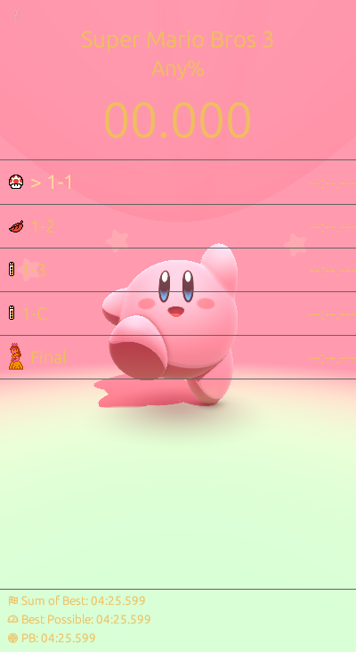

* [Vertex Shader](../assets/shaders/kirby/kirby.glsl.vert)
* [Fragment Shader](../assets/shaders/kirby/kirby.glsl)

# Retrowave
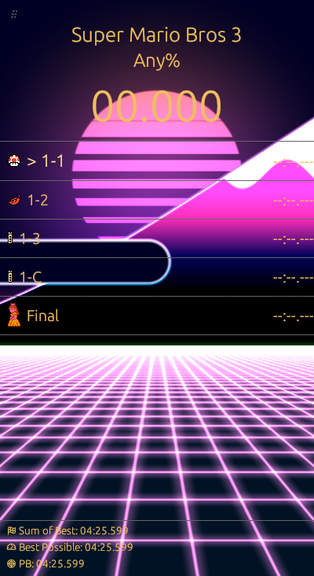

* [Vertex Shader](../assets/shaders/retrowave/retrowave.glsl.vert)
* [Fragment Shader](../assets/shaders/retrowave/retrowave.glsl)

# Space
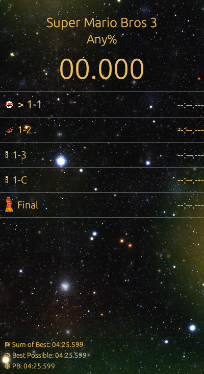

* [Vertex Shader](../assets/shaders/space/space.glsl.vert)
* [Fragment Shader](../assets/shaders/space/space.glsl)

# Lines
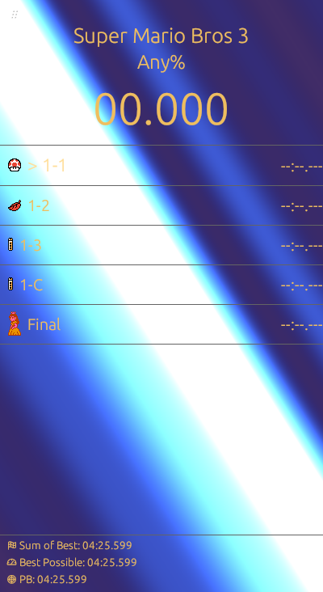
* [Vertex Shader](../assets/shaders/lines/lines.glsl.vert)
* [Fragment Shader](../assets/shaders/lines/lines.glsl)

# Threads
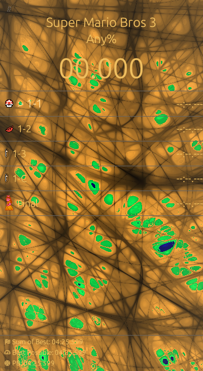
* [Vertex Shader](../assets/shaders/threads/threads.glsl.vert)
* [Fragment Shader](../assets/shaders/threads/threads.glsl)

# Waves
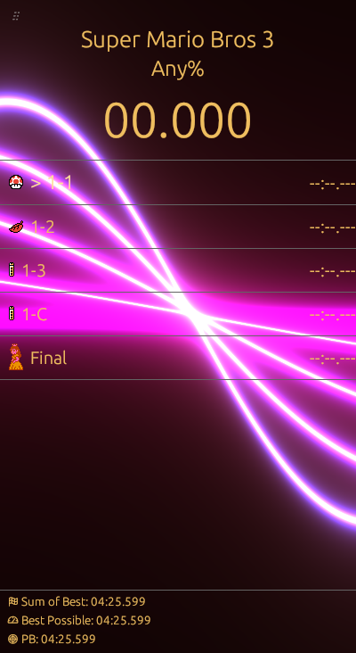
* [Vertex Shader](../assets/shaders/waves/waves.glsl.vert)
* [Fragment Shader](../assets/shaders/waves/waves.glsl)

# Landscape
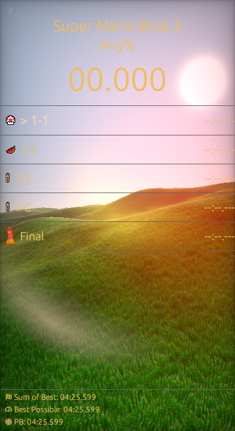
* [Vertex Shader](../assets/shaders/landscape/landscape.glsl.vert)
* [Fragment Shader](../assets/shaders/landscape/landscape.glsl)

# Fog
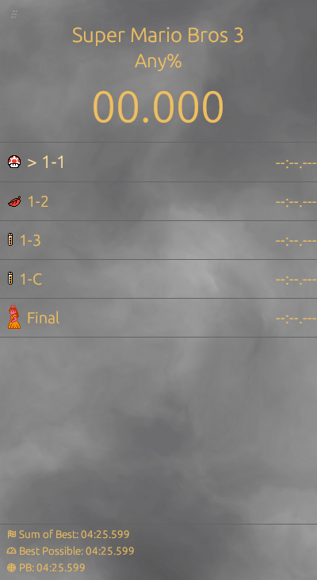
* [Vertex Shader](../assets/shaders/fog/fog.glsl.vert)
* [Fragment Shader](../assets/shaders/fog/fog.glsl)

# Clouds
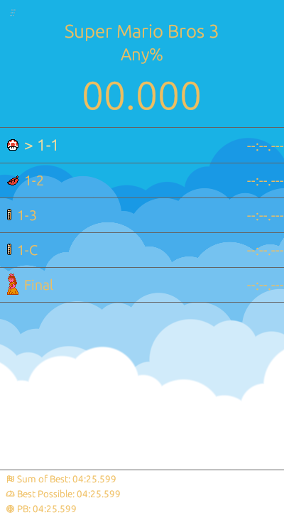
* [Vertex Shader](../assets/shaders/clouds/clouds.glsl.vert)
* [Fragment Shader](../assets/shaders/clouds/clouds.glsl)

# Conjuring
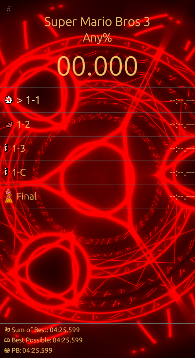
* [Vertex Shader](../assets/shaders/conjuring/conjuring.glsl.vert)
* [Fragment Shader](../assets/shaders/conjuring/conjuring.glsl)

# Vortex
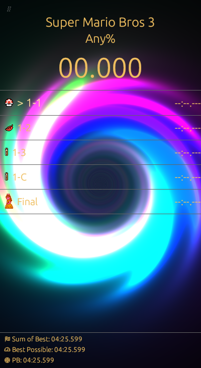
* [Vertex Shader](../assets/shaders/vortex/vortex.glsl.vert)
* [Fragment Shader](../assets/shaders/vortex/vortex.glsl)

# Bacterium
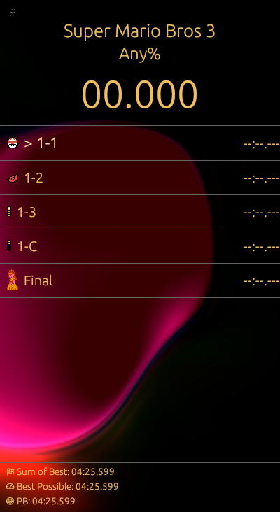
* [Vertex Shader](../assets/shaders/bacterium/bacterium.glsl.vert)
* [Fragment Shader](../assets/shaders/bacterium/bacterium.glsl)

# Orange
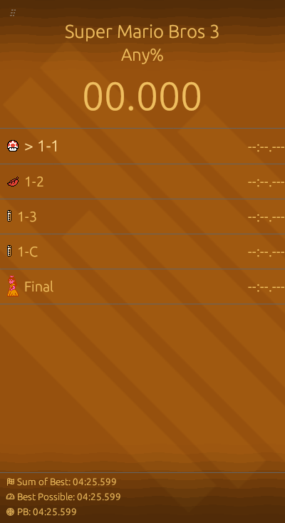
* [Vertex Shader](../assets/shaders/orange/orange.glsl.vert)
* [Fragment Shader](../assets/shaders/orange/orange.glsl)